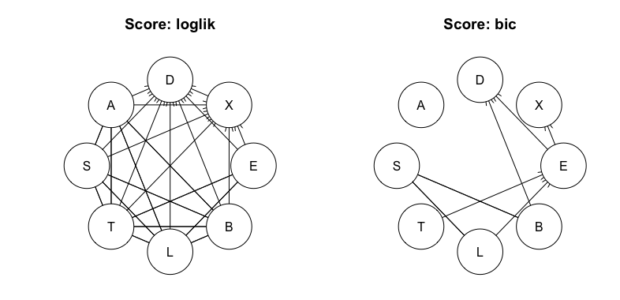
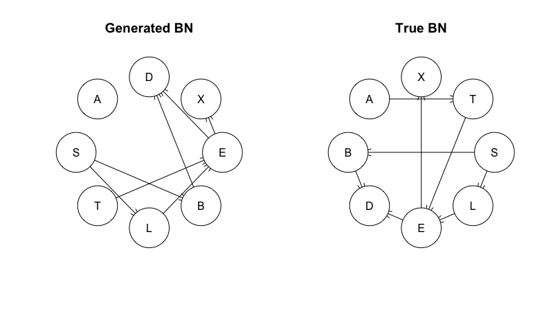
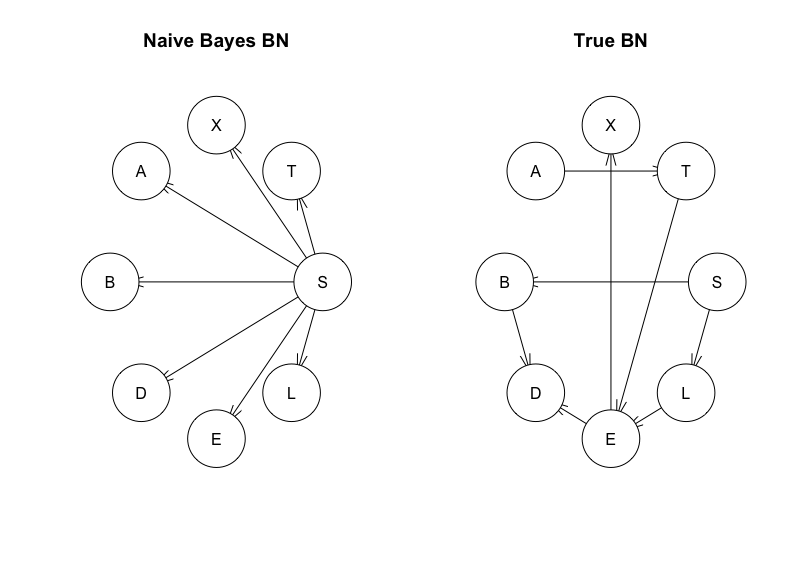

```{r setup, include=FALSE}
knitr::opts_chunk$set(echo = TRUE)
library(kableExtra)
```

\newpage

# 1

I generated two networks with the hill-climbing algorithm using two different score functions: log likhelihood and bayesian information criterion. Due to the lack of parameter punishment in the log likelihood, it generated the complete graph as output. The two networks are clearly non equivalent.



```{r eval=FALSE, echo=TRUE}
###### Assignment 1 ######
# Show non-equivalent BN structures for multiple runs of the HC algorithm

data('asia')

par(mfrow=c(1,2))

# With log-likelihood as score function
set.seed(1)
hc_loglik <- hc(x = asia, score='loglik')
plot(hc_loglik)
hc_loglik <- cpdag(hc_loglik)
plot(hc_loglik, main='Score: loglik') # Generates complete network due to lack of parameter punishment

# With bayesian information criterion as score function
set.seed(1)
hc_bic <- hc(x = asia, score = 'bic')
hc_bic <- cpdag(hc_bic)
plot(hc_bic, main='Score: bic')

# Check equality
print(all.equal(hc_loglik, hc_bic))
# Nope
```

\newpage

# 2

The resulting network generated an identical confusion matrix to the true network. Looking at the plots, this is most likely due to the same structure of outgoing edges from S, which was predicted on. If this were to be changed to node A, it would most likely generate conflicting results. The overall accuracy wasn't great, so if we only were interested in lowering either the false positive or false negative, the evaluated posterior probability should be compared to a more biased value than 0.5, f.i. setting it to 0.9 would make the model classify true only when it's very certain, drastically decreasing the false positives (but ofc increasing the false negatives).

Confusion Matrix - True BN
\begin{table}[ht]
\begin{tabular}{|c|cc|}
\hline
& False & True \\
\hline
False & 341 & 157 \\
True & 119 & 383 \\
\hline
\end{tabular}
\label{ }
\end{table}
Confusion Matrix - generated BN
\begin{table}[ht]
\begin{tabular}{|c|cc|}
\hline
& False & True \\
\hline
False & 341 & 157 \\
True & 119 & 383 \\
\hline
\end{tabular}
\label{ }
\end{table}




\newpage

```{r eval=FALSE, echo=TRUE}
###### Assignment 2 ######
# Learn a BN from 80% of the data and classify on the rest, compare with true BN

confusionMatrix <- function(BN, data, obs_var, pred_var) {
  predictions <- rep(0, nrow(data))
  for(i in 1:nrow(data)) {
    X <- NULL
    for(j in obs_var) {
      X[j] <- if(data[i,j] == 'yes') 'yes' else 'no'
    }
    # X <- data[i,obs_var] didn't work, even though it returns the same as the loop above
    find <- setEvidence(object=BN, nodes=obs_var, states=X) # Recommended over setFinding
    dist <- querygrain(object=find, nodes=pred_var)[[pred_var]]
    predictions[i] <- if(dist['yes'] >= 0.5) 'yes' else 'no'
  }
  return (table(data[,pred_var], predictions, dnn=c("TRUE", "PRED")))
}

set.seed(123)
samples <- sample(1:nrow(asia), size = floor(0.8*nrow(asia)), replace = FALSE)
train <- asia[samples, ]
test  <- asia[-samples, ]

# Create networks
BN_train <- hc(train, restart=3, score = 'bic')
BN_true = model2network("[A][S][T|A][L|S][B|S][D|B:E][E|T:L][X|E]")

par(mfrow=c(1,2))
plot(BN_train, main='Generated BN')
plot(BN_true, main='True BN')

# Convert to grain and run Lauritzen-Spiegelhalter
BN_train <- compile(as.grain(bn.fit(BN_train, train)))
BN_true <- compile(as.grain(bn.fit(BN_true, train)))

# Predict and generate confusion matrices
conf_matrix <- confusionMatrix(BN_train,
                                data=test,
                                obs_var=c('A', 'D', 'X', 'E', 'B', 'L', 'T'),
                                pred_var='S')
conf_matrix_true <- confusionMatrix(BN_true,
                                     data=test,
                                     obs_var=c('A', 'D', 'X', 'E', 'B', 'L', 'T'),
                                     pred_var='S')

# How can they be identical? Am I a pro? No: P(B|S)P(L|S)
```

\newpage

# 3

The confusion matrices were equal to those in 2), which supports the d-separation theorem for markov blankets. As described in 2), the markov blanket for both graphs are identical, yielding the similar results.

$MB_{hc}(S) = MB_{true}(S) = [B, L]$

Confusion Matrix - True BN
\begin{table}[ht]
\begin{tabular}{|c|cc|}
\hline
& False & True \\
\hline
False & 341 & 157 \\
True & 119 & 383 \\
\hline
\end{tabular}
\label{ }
\end{table}
Confusion Matrix - generated BN
\begin{table}[ht]
\begin{tabular}{|c|cc|}
\hline
& False & True \\
\hline
False & 341 & 157 \\
True & 119 & 383 \\
\hline
\end{tabular}
\label{ }
\end{table}

\newpage

# 4



Confusion Matrix - Naive Bayes
\begin{table}[ht]
\begin{tabular}{|c|cc|}
\hline
& False & True \\
\hline
False & 374 & 124 \\
True & 181 & 321 \\
\hline
\end{tabular}
\label{ }
\end{table}
Confusion Matrix - generated BN
\begin{table}[ht]
\begin{tabular}{|c|cc|}
\hline
& False & True \\
\hline
False & 341 & 157 \\
True & 119 & 383 \\
\hline
\end{tabular}
\label{ }
\end{table}


```{r eval=FALSE, echo=TRUE}
###### Assignment 4 ######

# Create a naive bayes classifier on S
# Naive bayes, wiki: "The value of a particular feature is independent
# of the value of any other feature, given the class variable. For example,
# a fruit may be considered to be an apple if it is red, round,
# and about 10 cm in diameter."

set.seed(123)
samples <- sample(1:nrow(asia), size = floor(0.8*nrow(asia)), replace = FALSE)
train <- asia[samples, ]
test  <- asia[-samples, ]

# Nodes: S, c('A', 'D', 'X', 'E', 'B', 'L', 'T')

BN_train = model2network("[S][A|S][D|S][X|S][E|S][B|S][L|S][T|S]")
BN_true = model2network("[A][S][T|A][L|S][B|S][D|B:E][E|T:L][X|E]")

par(mfrow=c(1,2))
plot(BN_train, main='Naive Bayes BN')
plot(BN_true, main='True BN')

# Convert to grain and run Lauritzen-Spiegelhalter
BN_train <- compile(as.grain(bn.fit(BN_train, train)))
BN_true <- compile(as.grain(bn.fit(BN_true, train)))

# Predict and generate confusion matrices
conf_matrix <- confusionMatrix(BN_train,
                               data=test,
                               obs_var=c('A', 'D', 'X', 'E', 'B', 'L', 'T'),
                               pred_var='S')
conf_matrix_true <- confusionMatrix(BN_true,
                                    data=test,
                                    obs_var=c('A', 'D', 'X', 'E', 'B', 'L', 'T'),
                                    pred_var='S')
```

# 5

A short comparison between 2) & 3) can be found in 3).

The reason the results differ is reasonably due to the vastly different structure, resulting in a different markov blanket, with all other nodes appearing as conditionally independent children given S.