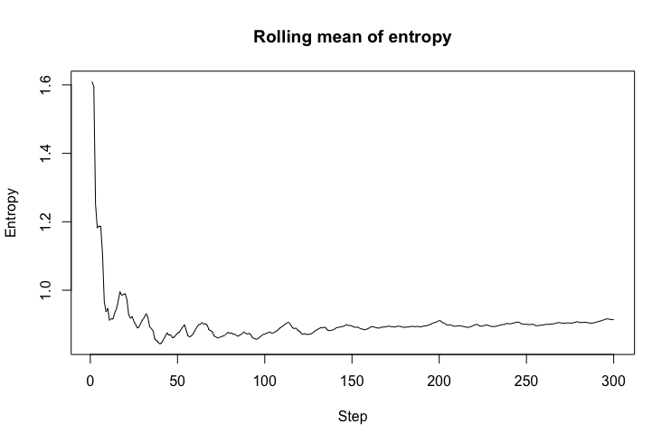

```{r setup, include=FALSE}
knitr::opts_chunk$set(echo = TRUE)
library(kableExtra)

tProb <- 0.5
nStates <- 10
states = symbols <- 1:10

getNoiseInterval <- function(index, nStates, noise) {
  start <- index - noise
  end <- index + noise
  interval <- start:end %% nStates
  interval[interval==0] <- nStates
  return(interval)
}

transProbs <- tProb * diag(nStates)
for(i in 1:nStates) {
  transProbs[i,(i %% nStates + 1)] <- tProb
}

# Initialize emission probabilities. P(X-2) = P(X-1) = P(X) = P(X+1) = P(X+2) = 0.2
eProb <- 0.2
emissionProbs <- matrix(0, nrow = nStates, ncol = nStates)
noise <- 2
for(i in 1:nStates) {
  emissionProbs[i,getNoiseInterval(i, nStates, noise)] <- eProb
}

```


\newpage

# 1 - Model

The transition probability $p(x_{t+1}|x_t) = 0.5$ & $p(x_t|x_t) = 0.5$.

The emission/observation probability $p(y_{t-2}|x_t) = p(y_{t-1}|x_t) = p(y_{t}|x_t) = p(y_{t+1}|x_t) = p(y_{t+2}|x_t) = 0.2$.

This translates into the following matrices:

### Transition matrix

```{r, echo=FALSE, warning=FALSE}
colnames(transProbs) = 1:10
rownames(transProbs) = 1:10
kable(transProbs, row.names = 1:10)
```

### Emission matrix

```{r, echo=FALSE, warning=FALSE}
colnames(emissionProbs) = 1:10
rownames(emissionProbs) = 1:10
kable(emissionProbs, row.names = 1:10)
```

\newpage

```{r, echo=TRUE, eval=FALSE}

############### 1 ###############

set.seed(1234)
nStates <- 10
states = symbols <- 1:10

getNoiseInterval <- function(index, nStates, noise) {
  start <- index - noise
  end <- index + noise
  interval <- start:end %% nStates
  interval[interval==0] <- nStates
  return(interval)
}

# Initialize matrix with transition probabilities.
# P(X_1|X) = 0.5, P(X|X) = 0.5
tProb <- 0.5
transProbs <- tProb * diag(nStates)
for(i in 1:nStates) {
  transProbs[i,(i %% nStates + 1)] <- tProb
}

# Initialize emission probabilities.
# P(Y-2|X) = P(Y-1|X) = P(Y|X) = P(Y+1|X) = P(Y+2|X) = 0.2
eProb <- 0.2
emissionProbs <- matrix(0, nrow = nStates, ncol = nStates)
noise <- 2
for(i in 1:nStates) {
  emissionProbs[i,getNoiseInterval(i, nStates, noise)] <- eProb
}

HMM <- initHMM(States = states,
               Symbols = symbols,
               transProbs = transProbs,
               emissionProbs = emissionProbs)


```

\newpage

# 2 - Simulation

Simulation of 100 timesteps was trivial using the HMM library.

```{r, echo=TRUE, eval=FALSE}

############### 2 ###############

nSteps <- 100
sims <- simHMM(HMM, nSteps)

```

\newpage

# 3 - Forward/Backward and Path Calculation

```{r, echo=TRUE, eval=FALSE}

############### 3 ###############

# Exponential due to forward/backward returning log values
alpha <- exp(forward(HMM, sims$observation))
beta <- exp(backward(HMM, sims$observation))

# Normalizing at each time step to prevent underflow (?)
# and to, you know, normalize to obtain a prob. distr.
# Basically performs col[,i] / sum(col[,i]) to get the normalized distr.
filter <- prop.table(alpha, margin = 2)
smoother <- prop.table(alpha*beta, margin = 2)

# Evaluate most probable path using viterbi.
viterbiPath = viterbi(HMM, sims$observation)

# Generate path by maximizing the marginal probability for each individual timestep
filterPath <- apply(filter, MARGIN = 2, which.max)
smootherPath <- apply(smoother, MARGIN = 2, which.max)

```

\newpage

# 4 - Accuracy

```{r, echo=TRUE, eval=FALSE}

############### 4 ###############

accuracy <- function(path, states) {
  return(sum(diag(table(path, states)) / length(path)))
}

# 0.49
viterbiAccuracy = accuracy(viterbiPath, sims$states)

# 0.63
filterAccuracy =  accuracy(filterPath, sims$states)

# 0.75
smootherAccuracy =  accuracy(smootherPath, sims$states)

```

\newpage

# 5 - Verifying

Repeated trials yields the same result as in 4). The smoothed distribution appears to have a higher accuracy than both the most probable path and the filtered distribution. This is natural since the smoother is the joint probability of both future and past observations, thus containing more information than the filtered distribution. The viterbi algorithm only calculates the most probable sequence, which intuitively always will be less accurate than the path obtained by maximizing the marginal probability for each individual timestep, regardless of neighboring states.

```{r, echo=TRUE, eval=FALSE}

############### 5 ###############

sims <- simHMM(HMM, nSteps)

alpha <- exp(forward(HMM, sims$observation))
beta <- exp(backward(HMM, sims$observation))

filter <- prop.table(alpha, margin = 2)
smoother <- prop.table(alpha*beta, margin = 2)

viterbiPath = viterbi(HMM, sims$observation)
filterPath <- apply(filter, MARGIN = 2, which.max)
smootherPath <- apply(smoother, MARGIN = 2, which.max)

# 0.55
viterbiAccuracy = accuracy(viterbiPath, sims$states)

# 0.58
filterAccuracy =  accuracy(filterPath, sims$states)

# 0.73
smootherAccuracy =  accuracy(smootherPath, sims$states)

# Smoothing appears to perform better at evaluating the hidden states

```

\newpage

# 6 - Additional observations

{height=50%}

I calculated the entropy of the filtered distributions over 300 timesteps and evaluated a rolling mean from timestep 1 to $i \in [1:300]$. After repeated trials, the mean appeared to converge after 70-100 iterations, which would imply that further observations don't necessarily provide additional information.

```{r, echo=TRUE, eval=FALSE}

############### 6 ###############

# With 300 time steps
nSteps <- 300
sims300 <- simHMM(HMM, nSteps)
alpha300 <- exp(forward(HMM, sims300$observation))
filter300 <- prop.table(alpha300, margin = 2)

entropy300 <- apply(filter300, MARGIN = 2, entropy.empirical)

# Evaluate rolling mean from step 1 to current step i
rollingMeanEntropy <- rep(0, nSteps)
for(i in 1:nSteps) {
  rollingMeanEntropy[i] <- mean(entropy300[1:i])
}

plot(rollingMeanEntropy,
     type='l',
     main="Rolling mean of entropy",
     ylab = 'Entropy',
     xlab='Step')

# Comment: Converges after approx 70-100 steps.
# More observations does not appear to provide further information

```

\newpage

# 7 - Step 101

The state vector for the filtered distribution at timestep 100

$X_{100}$ = $$
[\begin{array}{cccccccccc}
0.654 & 0.345 & 0.000 & 0.000 & 0.000 & 0.000 & 0.000 & 0.000 & 0.000 & 0.000
\end{array}]
$$

Which, when multiplied with the transition matrix from 1) yields the probability distribution for the hidden state at timestep 101, 

$X_{101}$ = $$
[\begin{array}{cccccccccc}
0.327 & 0.500 & 0.173 & 0.000 & 0.000 & 0.000 & 0.000 & 0.000 & 0.000 & 0.000
\end{array}]
$$

```{r, echo=TRUE, eval=FALSE}

############### 7 ###############

hiddenStates101 <- colSums(filter[,100] * transProbs)

# P(X_101 = 1) = 0.33, P(X_101 = 2) = 0.50, P(X_101 = 3) = 0.17
# given filter[,100] = [0.65, 0.35, 0, ...]

```


