```{r setup, include=FALSE}
knitr::opts_chunk$set(echo = TRUE)
library(kableExtra)
```

\newpage

# Setup
```{r, echo=TRUE, eval=FALSE}
############# Function setup ###############

# Returns emission probabilities
# Returns density if density = TRUE
emissionModel <- function(mean,
                          sigma=1,
                          nSamples=1,
                          density=FALSE,
                          X,
                          noise=-1:1) {
  
  return(sum(sapply(noise,
                    function(n)
                      if(density)
                        dnorm(X, mean + n, sigma)
                      else
                        rnorm(nSamples, mean + n, sigma))) / 3)
}

# Returns transition probabilities
transitionModel <- function(mean,
                            transition=TRUE,
                            sigma=1,
                            nSamples=1,
                            noise=0:2) {
  
  return(sum(sapply(noise,
                    function(n) rnorm(nSamples,
                                      mean + n,
                                      sigma))) / 3)
}

# Yeah, this was super necessary
sampleUnif <- function(N, start=0, end=100) {
  return(runif(N, start, end))
}

# M = number of particles to sample
# T = number of timesteps, i.e. observations
# X = Observations from emission model
# Z = latent states
# zPred = belief for Z step t after step t-1
# If constant, the emission probability will be fixed to 1
particleFilter <- function(M, T, X, emissionSigma=1, constant=FALSE) {
  zPred <- matrix(0, nrow = T, ncol = M)
  Z <- matrix(0, nrow = T, ncol = M)
  w <- rep(0, M)
  
  # Initial belief
  Z[1,] <- sampleUnif(N=M)
  zPred[1,] <- sapply(Z[1,], function(x) transitionModel(mean=x))
  
  # The following loop is implemented according to the PF algorithm from lecture 8
  for(t in 2:T) { # Row 
    
    # Prediction
    for(m in 1:M) { # Col
      # Sample Z_t^m as p(z_t|z_t-1^m) from transition model & add to zPred 
      # calculate weight w_t as p(x|z_t^m) from emission model (density)
      zPred[t, m] = transitionModel(mean=Z[t-1, m])
      w[m] <- if(constant) 1 else emissionModel(mean = zPred[t, m],
                                                density = TRUE,
                                                X=X[t],
                                                sigma = emissionSigma)
    }
    
    # Correction
    # Sample with replacement from zPred with prob. prop. to w_t & add to Z
    Z[t,] = sample(x = zPred[t,], replace = TRUE, size = M, prob = w)
  }
  return(Z)
}

# Simulate observations
simulate <- function(T, emissionSigma=1) {
  states <- rep(0, T)
  observations <- rep(0, T)
  
  # First iteration
  states[1] <- sampleUnif(1)
  observations[1] <- emissionModel(mean = states[1], sigma = emissionSigma)
  
  for(t in 2:T) {
    states[t] <- transitionModel(mean = states[t-1])
    observations[t] <- emissionModel(mean = states[t], sigma = emissionSigma)
  }
  
  return(list(states=states, observations=observations))
}

# Plots histogram of particles &
# a comparison between the true state and particles, for timestep t
# Also calculates the Mean Absolute Error
plotParticles <- function(particles, simulations, step) {
  Z <- simulations$states[step]
  par(mfrow=c(2,1), mar=c(2,2,2,2))
  hist(particles[step,], 25, xlab = '', main = paste('Step', step))
  legend('topright',
         legend = c('True state', 'Particle mean'),
         fill = c('red', 'green'))
  abline(v=Z, col='red')
  abline(v=mean(particles[step,]), col='green')
  plot(particles[step,],
       xlab = '', 
       ylim = c(min(particles[step,])*0.95, max(particles[step,])*1.05))
  abline(h=Z, col='red')
  abline(h=mean(particles[step,]), col='green')
  legend('bottomright', legend = c(
    paste('MAPE',eval(round(mean(abs(Z - particles[step,])/Z), 5)), '%'),
    paste('MAE',eval(round(mean(abs(Z - particles[step,])), 5)))))
}

# Plot the residual between the particles and the true values
plotResidual <- function(particles, simulations, sigma) {
  res <- rowMeans(particles) - simulations$states
  plot(res[2:length(res)], type='l', ylim=c(-20, 20), main=paste('sd = ', eval(sigma)))
}
```


# Model

Transition model

$p(z_t|z_{t-1})$ =$\frac{\mathcal{N}(z_t|z_{t-1}, 1) + \mathcal{N}(z_t|z_{t-1} + 1, 1) + \mathcal{N}(z_t|z_{t-1} + 2, 1)}{3}$


Emission model

$p(x_t|z_t)$ =$\frac{\mathcal{N}(x_t|z_t, 1) + \mathcal{N}(x_t|z_t-1, 1) + \mathcal{N}(x_t|z_t+1, 1)}{3}$


Initial model

$p(z_1) = Uniform(0,100)$

\newpage

# 1

I plotted the particles at timestep 1, 25, 75 and 100 and evaluated the MAE as well as MAPE score in order to track the progress.

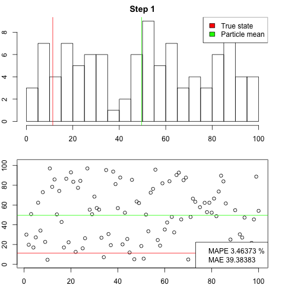{height=55%}

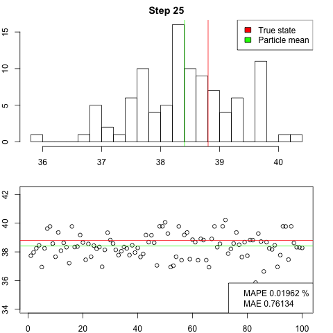{height=55%}

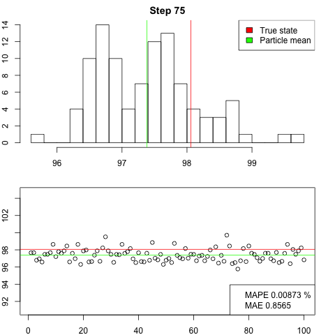{height=60%}

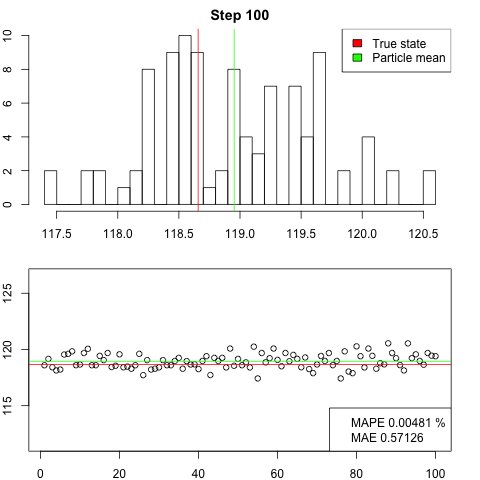{height=60%}

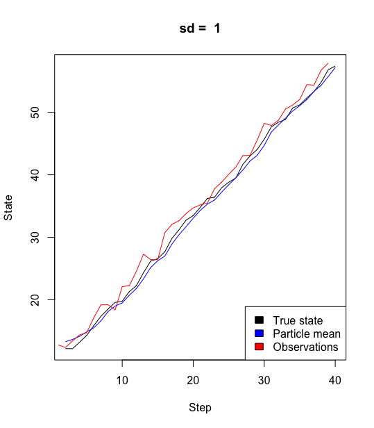{height=70%}

```{r, echo=TRUE, eval=FALSE}
################ 1 ################
set.seed(1234)
T = M <- 100
simulations <- simulate(T)
particles <- particleFilter(T=T, M=M, X=simulations$observations)

plotParticles(particles = particles, simulations = simulations, step=1)
plotParticles(particles = particles, simulations = simulations, step=25)
plotParticles(particles = particles, simulations = simulations, step=75)
plotParticles(particles = particles, simulations = simulations, step=100)

plotCurve(particles = particles, simulations = simulations)
```

\newpage

# 2

I started with plotting traceplots with sd = 5 and sd = 50, as in 1), which turned out to be a bit messy when the variance of the observations got higher. In order to evaluate and compare the different models, I plotted the residual of the true state and particle mean for the different standard deviations. It's surprising how well the filter performs even for higher sigmas, although it struggles when the variance gets absurd. This shows that although the variance of the particles might be high, evaluating the mean will still generate a reasonably good prediction. Thus, more noise (higher emission variance) probably requires a larger number of particles in order to give accurate predictions.

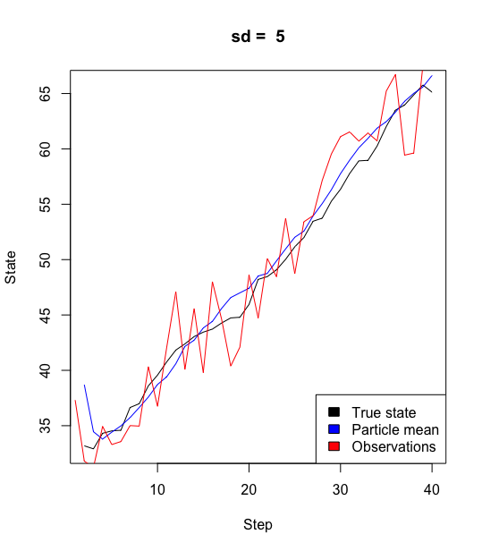{width=50%} 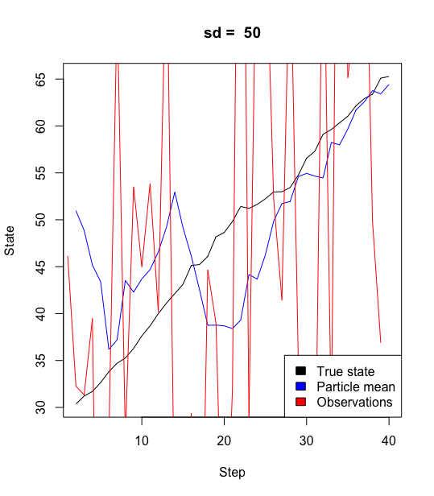{width=50%}

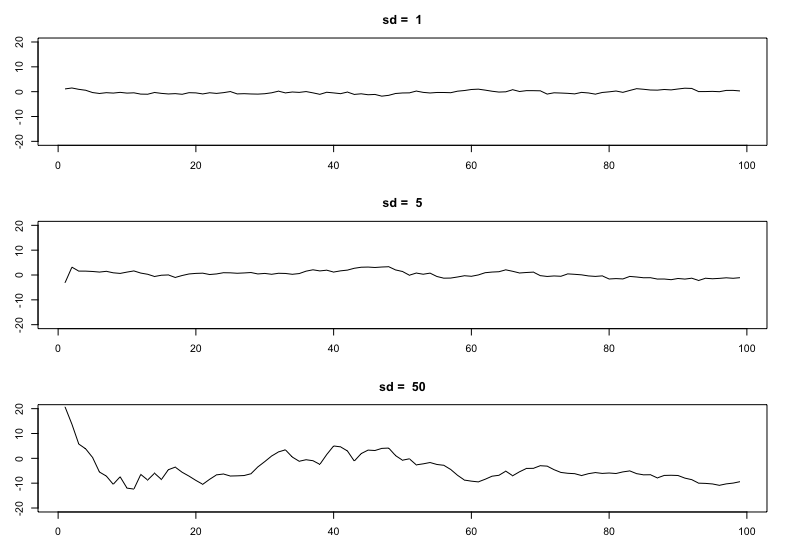{height=45%}

```{r, echo=TRUE, eval=FALSE}
################ 2 ################
set.seed(1234)
T = M <- 100

par(mfrow=c(3,1), mar=c(3,3,3,3))

# Standard deviation = 1
simulations <- simulate(T)
particles <- particleFilter(T=T, M=M, X=simulations$observations)
plotResidual(particles, simulations,1)

# Standard deviation = 5
simulations <- simulate(T, emissionSigma = 5)
particles <- particleFilter(T=T, M=M, X=simulations$observations, emissionSigma = 5)
plotResidual(particles, simulations, 5)

# Standard deviation = 50
simulations <- simulate(T, emissionSigma = 50)
particles <- particleFilter(T=T, M=M, X=simulations$observations, emissionSigma = 50)
plotResidual(particles, simulations, 50)

```

\newpage

# 3

Without correction, the particles seem to converge towards two different values. I would have expected the particles to be distributed almost according to the initial uniform model, since we sample from the particles with unweighted probability.

{height=50%}
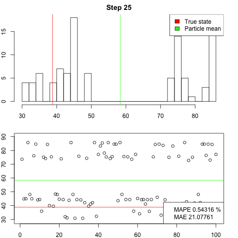{height=50%}
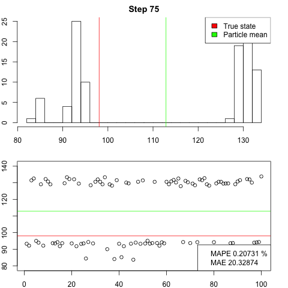{height=50%}
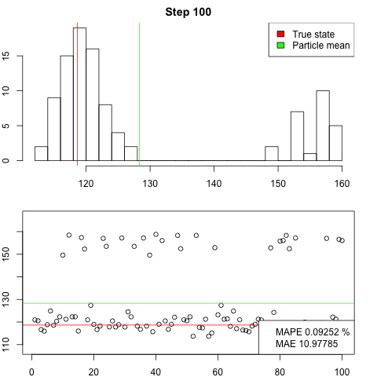{height=50%}

```{r, echo=TRUE, eval=FALSE}
################ 3 ################
set.seed(1234)
T = M <- 100
simulations <- simulate(T)
particles <- particleFilter(T=T, M=M, X=simulations$observations, constant = TRUE)

plotParticles(particles = particles, simulations = simulations, step=1)
plotParticles(particles = particles, simulations = simulations, step=25)
plotParticles(particles = particles, simulations = simulations, step=75)
plotParticles(particles = particles, simulations = simulations, step=100)
```


