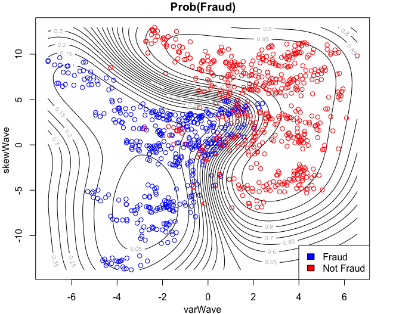

  
  
```{r setup, include=FALSE}
knitr::opts_chunk$set(echo = TRUE)
library(kableExtra)
```


\newpage

# Function Setup

```{r, echo=TRUE, eval=FALSE}
####### Functions #######

# Squared exponential kernel from lecture examples
# Courtesy of Jose M. Pena, LiU
squaredExponential <- function(x1,x2,sigmaF,l){
  n1 <- length(x1)
  n2 <- length(x2)
  K <- matrix(NA,n1,n2)
  for (i in 1:n2){
    K[,i] <- sigmaF^2 * exp( -0.5 * ( (x1 - x2[i]) / l)^2 )
  }
  return(K)
}

# Prediction function from Rasmussen & Williams
# X = Training inputs
# y = Training targets/outputs
# XStar = Vector of inputs where the posterior distr. is evaluated
# hyperParam = kernel parameters sigma_f and l
# sigmaNoise = Noise sigma_n
# K = Kernel function
posteriorGP <- function(X, y, XStar, sigmaF, l, sigmaNoise, K) {
  
  # Need to transpose cholesky matrix to attain lower triangular matrix
  L <- t(chol(K(X, X, sigmaF, l) + sigmaNoise^2 * diag(length(X))))
  alpha <- solve(t(L), solve(L, y))
  
  # Predictive mean
  kStar <- K(X, XStar, sigmaF, l)
  fBar <- t(kStar) %*% alpha
  
  # Predictive variance
  v <- solve(L, kStar)
  vf <- K(XStar, XStar, sigmaF, l) - t(v) %*% v
  
  return(list(mean=fBar, variance=diag(vf)))
}


plotGP <- function(XStar, X, y, mean, sd) {
  plot(XStar,
       posterior$mean,
       type='l',
       ylim=c(min(posterior$mean) - 3,max(posterior$mean) + 3))
  points(X, y)
  quantile <- qnorm(0.975)
  lines(XStar, mean + quantile * sd, col='grey')
  lines(XStar, mean - quantile * sd, col='grey')
  legend('topleft', legend = c('Mean', 'Probability band'), fill = c('black', 'grey'))
}
```

\newpage

# 2.1 - GP Regression implementation

GP model to implement:
$y = f(x) + \epsilon$ with $\epsilon$ ~ $N(0, \sigma_n^2)$ and $f$ ~ $GP(0, k(x, x'))$

## 2.1.1

The implementation for the posterior of the GP above was implemented using the algorithm described by Rasmussen & Williams.

```{r, echo=TRUE, eval=FALSE}
####### 2.1.1 #######
# See posteriorGP and squaredExponential above
```


## 2.1.2

The prior was updated with the point $(x,y) = (0.4, 0.719)$, using the the parameters $\sigma_f = 1$, $l = 0.3$ and $\sigma_n = 0.1$, after which the posterior mean was plotted with 95% probability bands. The generated plot clearly indicates a smaller variance around the observation.

{height=50%}

```{r, echo=TRUE, eval=FALSE}
####### 2.1.2 #######
sigmaF <- 1
l <- 0.3
XStar <- seq(-1, 1, length.out = 100)
y <- c(0.719)
X <- c(0.4)
sigmaN <- 0.1

posterior <- posteriorGP(X, y, XStar, sigmaF, l, sigmaN, squaredExponential)
plotGP(XStar, X, y, posterior$mean, sqrt(posterior$variance))
```

\newpage

## 2.1.3

The posterior was updated with yet another observation and plotted. Same conclusion as 2.1.2.

JMP: Updating the posterior after one observation with a new observation gives the same result as updating the prior directly with the two observations.

But that must be less efficient, right? Not even sure how to update the posterior.


```{r, echo=TRUE, eval=FALSE}
####### 2.1.3 #######
y <- c(0.719, -0.044)
X <- c(0.4, -0.6)
posterior <- posteriorGP(X, y, XStar, sigmaF, l, sigmaN, squaredExponential)
plotGP(XStar, X, y, posterior$mean, sqrt(posterior$variance))
```

\newpage

## 2.1.4

Now with five observations. The posterior starts to resemble a decent regression curve, despite the small number of obsvervations.

\begin{table}[ht]
\centering
\begin{tabular}{c|rrrrr}
x & -1.0 & -0.6 & -0.2 & 0.4 & 0.8 \\
\hline
y & 0.768 & -0.044 & -0.940 & 0.719 & -0.664
\end{tabular}
\end{table}


```{r, echo=TRUE, eval=FALSE}
####### 2.1.4 #######
y <- c(0.719, -0.044, 0.768, -0.940, -0.664)
X <- c(0.4, -0.6, -1, -0.2, 0.8)
posterior <- posteriorGP(X, y, XStar, sigmaF, l, sigmaN, squaredExponential)
plotGP(XStar, X, y, posterior$mean, sqrt(posterior$variance))
```

\newpage

## 2.1.5

Same as 2.1.4, but with $\sigma_f = 1$ and $l = 1$.

A higher value for $l$ gives a wider span in which the observations will affect the posterior (higher covariance), thus decreasing the overall uncertainty/variance in-between observations, making the model smoother, and possibly makes the model more prone to underfit. Looking at the plot, $l = 1$ seems to result in underfitting the data.

{height=80%}

```{r, echo=TRUE, eval=FALSE}
####### 2.1.5 #######
sigmaF <- 1
l <- 1
```

\newpage

# 2.2 - GP Regression with kernlab

## Setup

```{r, echo=TRUE, eval=FALSE}
# Setup
temp <- read.csv("https://github.com/STIMALiU/AdvMLCourse/raw/master/GaussianProcess/Code/TempTullinge.csv",
         header=TRUE,
         sep=";")
time <- 1:2190
day <- rep(1:365, 6)

# Sample (so what I just specified was pointless)
samples <- seq(1, 2190, by=5)
time <- time[samples]
day <- day[samples]
tempSamples <- temp$temp[samples]
```

## 2.2.1

$K(1, 2) = 0.6065307$

$X = (1, 3, 4)^T$ & $X_* = (2, 3, 4)^T$

$K(X, X_*)$ = $$\begin{pmatrix}
0.6065307 & 0.1353353 & 0.0111090 \\
0.6065307 & 1.0000000 & 0.6065307 \\
0.1353353 & 0.6065307 &1.0000000 \\
\end{pmatrix}$$

```{r, echo=TRUE, eval=FALSE}
####### 2.2.1 #######
squaredExponentialKernel <- function(ell, sigmaf) {
  squaredExponential <- function(x, y = NULL) {
    n1 <- length(x)
    n2 <- length(y)
    K <- matrix(NA,n1,n2)
    for (i in 1:n2){
      K[,i] <- sigmaf^2 * exp( -0.5 * ( (x - y[i]) / ell)^2 )
    }
    return(K)
  }
  class(squaredExponential) <- 'kernel'
  return(squaredExponential)
}

SEkernel <- squaredExponentialKernel(ell = 1, sigmaf = 1)

SEkernel(1,2)

X <- c(1,3,4)
XStar <- c(2,3,4)

K <- kernelMatrix(kernel = SEkernel,
             x = X,
             y = XStar)
```


## 2.2.2

### Model using time as input

$temp = f(time) + \epsilon$ with $\epsilon$ ~ $N(0,\sigma_n^2)$ and $f$ ~ $GP(0,k(time,time'))$

Fitted a second degree polynomial due to the characteristics of the data. The generated GP seems to fit the data fairly well.


```{r, echo=TRUE, eval=FALSE}
####### 2.2.2 #######
plot(temp$temp)

# Fitting a second degree polynomial due to characteristics of the data
fit <- lm(formula=tempSamples ~ time + I(time^2))
sigmaNoise <- sd(fit$residuals)

sigmaF <- 20
l <- 0.2
SEkernel <- squaredExponentialKernel(ell = l, sigmaf = sigmaF)

GPfit <- gausspr(time, tempSamples, kernel = SEkernel, var = sigmaNoise^2)
meanPred <- predict(GPfit, time) # Predicting the training data. To plot the fit.

plot(time, tempSamples, pch=20, ylab='Temp', xlab='Time')
lines(time, meanPred, col="blue", lwd = 2)

# As before, increasing l results in underfitting
# Setting a small sigmaF also results in underfitting, otherwise minor effect
```


## 2.2.3

I consider the fitted model to be quite good, however underfitting somewhat when considering the extremes.


```{r, echo=TRUE, eval=FALSE}
####### 2.2.3 #######
posterior <- posteriorGP(X = scale(time),
                         y = scale(tempSamples),
                         XStar = scale(time),
                         sigmaF = sigmaF,
                         l = l,
                         sigmaNoise = sigmaNoise,
                         K = squaredExponential)

quantile <- qnorm(0.025)
lines(time, meanPred - quantile * sqrt(posterior$variance),
      col = "grey", lwd = 2)
lines(time, meanPred + quantile * sqrt(posterior$variance),
      col = "grey", lwd = 2)
legend('bottomright',
       legend = c('Posterior mean', 'Probability band'),
       fill = c('black', 'grey'))

```


## 2.2.4

### Model using day as input

$temp = f(day) + \epsilon$ with $\epsilon$ ~ $N(0,\sigma_n^2)$ and $f$ ~ $GP(0,k(day,day'))$

This model also generates a reasonably good model, although not as smooth as in 2.2.2. One possible reason for using this instead would be that it appears to be slightly better at capturing the extremes.


```{r, echo=TRUE, eval=FALSE}
####### 2.2.4 #######
fit <- lm(formula=tempSamples ~ day + I(day^2))
sigmaNoise <- sd(fit$residuals)

GPfit <- gausspr(day, tempSamples, kernel = SEkernel, var = sigmaNoise^2)
meanPredDay <- predict(GPfit, day) # Predicting the training data. To plot the fit.

plot(time, tempSamples, pch=20, ylab='Temp', xlab='Time')
lines(time, meanPred, col="blue", lwd = 2)
lines(time, meanPredDay, col="red", lwd = 2)
legend('bottomright', legend = c('Day', 'Time'), fill = c('red', 'blue'))
```


## 2.2.5

The GP with a periodic kernel also appeared to be a good fit. I would prefer this model over the others since it allows more configurability, although increasing the need to select reasonable hyperparameters in order to avoid under/overfitting.


```{r, echo=TRUE, eval=FALSE}
####### 2.2.5 #######

sigmaF <- 20
l1 <- 1
l2 <- 10
d = 365 / sd(time) # Using the sampled interval, nearly the same as sd(1:2190)

PKernel <- function(l1, l2, d, sigmaF) {
  periodicKernel <- function(x, y = NULL) {
    K <- sigmaF^2*exp(-2*sin(pi*abs(x-y)/d)^2/l1^2)*exp(-0.5*abs(x-y)^2/l2^2)
    return(K)
  }
  class(periodicKernel) <- 'kernel'
  return(periodicKernel)
}

pk <- PKernel(l1, l2, d, sigmaF)

fit <- lm(formula=tempSamples ~ time + I(time^2))
sigmaNoise <- sd(fit$residuals)

GPfit <- gausspr(time, tempSamples, kernel = pk, var = sigmaNoise^2)
meanPredPeriodic <- predict(GPfit, time)

plot(time, tempSamples, pch=20, ylab='Temp', xlab='Time')
lines(time, meanPred, col="blue", lwd = 2)
lines(time, meanPredDay, col="red", lwd = 2)
lines(time, meanPredPeriodic, col="green", lwd = 2)
legend('bottomright',
       legend = c('Day', 'Time', 'Time + Periodic Kernel'),
       fill = c('red', 'blue', 'green'))

```

\newpage

# 2.3 - Classification with kernlab

## Setup
```{r, echo=TRUE, eval=FALSE}
# Setup
accuracy <- function(confMatrix) {
  return(sum(diag(confMatrix))/sum(confMatrix))
}

data <- read.csv("https://github.com/STIMALiU/AdvMLCourse/raw/master/GaussianProcess/Code/banknoteFraud.csv",
                 header=FALSE,
                 sep=",")

names(data) <- c("varWave","skewWave","kurtWave","entropyWave","fraud")
data[,5] <- as.factor(data[,5])

set.seed(111)
SelectTraining <- sample(1:dim(data)[1], size = 1000, replace = FALSE)
train <- data[SelectTraining,]
test <- data[-SelectTraining,]
```

## 2.3.1 - Using varWave and skewWave to classify

Accuracy = 0.932

Confusion Matrix
\begin{table}[ht]
\begin{tabular}{|c|cc|}
\hline
& False & True \\
\hline
False & 512 & 24 \\
True & 44 & 420 \\
\hline
\end{tabular}
\label{ }
\end{table}
{height=50%}

```{r, echo=TRUE, eval=FALSE}
# Using varWave and skewWave to classify
GPfit <- gausspr(fraud ~  varWave + skewWave, data=train)

# Predict on the training set
GPpred <- predict(GPfit, train[, c(T, T, F, F, F)]) # Doesn't seem to be necessary
confM <- table(GPpred, train[,5]) # confusion matrix
accuracy(confM)

# Class probabilities 
probPreds <- predict(GPfit, train[, c(T, T, F, F, F)], type="probabilities")
x1 = seq(min(train$varWave), max(train$varWave), length=100)
x2 = seq(min(train$skewWave), max(train$skewWave), length=100)
gridPoints <- meshgrid(x1, x2)
gridPoints <- cbind(c(gridPoints$x), c(gridPoints$y))
gridPoints <- data.frame(gridPoints)
names(gridPoints) <- names(train)[c(1,2)]
probPreds <- predict(GPfit, gridPoints, type="probabilities")

# Contour plot
contour(x1,
        x2,
        matrix(probPreds[,1], 100, byrow = TRUE),
        20,
        xlab = "varWave",
        ylab = "skewWave",
        main = 'Prob(Fraud)')
points(train$varWave[train$fraud == 1],
       train$skewWave[train$fraud == 1],
       col = 'blue')
points(train$varWave[train$fraud == 0],
       train$skewWave[train$fraud == 0],
       col = 'red')

legend('bottomright', legend = c('Fraud', 'Not Fraud'), fill = c('Blue', 'Red'))
```

## 2.3.2

Accuracy = 0.9354839, which is pretty much the same as the accuracy on the training data. Not great, not terrible.

Confusion Matrix
\begin{table}[ht]
\begin{tabular}{|c|cc|}
\hline
& False & True \\
\hline
False & 191 & 9 \\
True & 15 & 157 \\
\hline
\end{tabular}
\label{ }
\end{table}

```{r, echo=TRUE, eval=FALSE}
####### 2.3.2 #######
# Predict on the test data
GPtest <- predict(GPfit, test[, c(T, T, F, F, F)]) # Doesn't seem to be necessary
confusionMatrix <- table(GPtest, test[,5])
accuracy(confusionMatrix)
```


## 2.3.3

Accuracy on test data = 0.9973118. Great! Just one wrongly predicted out of 372 samples. Overfitting not likely since test data.

Confusion Matrix
\begin{table}[ht]
\begin{tabular}{|c|cc|}
\hline
& False & True \\
\hline
False & 205 & 0 \\
True & 1 & 166 \\
\hline
\end{tabular}
\label{ }
\end{table}

```{r, echo=TRUE, eval=FALSE}
####### 2.3.3 #######
# Use all available covariates
GPfit <- gausspr(fraud ~  varWave + skewWave + kurtWave + entropyWave, data=train)

# Predict on test data
GPtest <- predict(GPfit, test[, c(T, T, T, T, F)]) # Doesn't seem to be necessary
confusionMatrix <- table(GPtest, test[,5]) 
accuracy(confusionMatrix)
# WOW! High!
```
